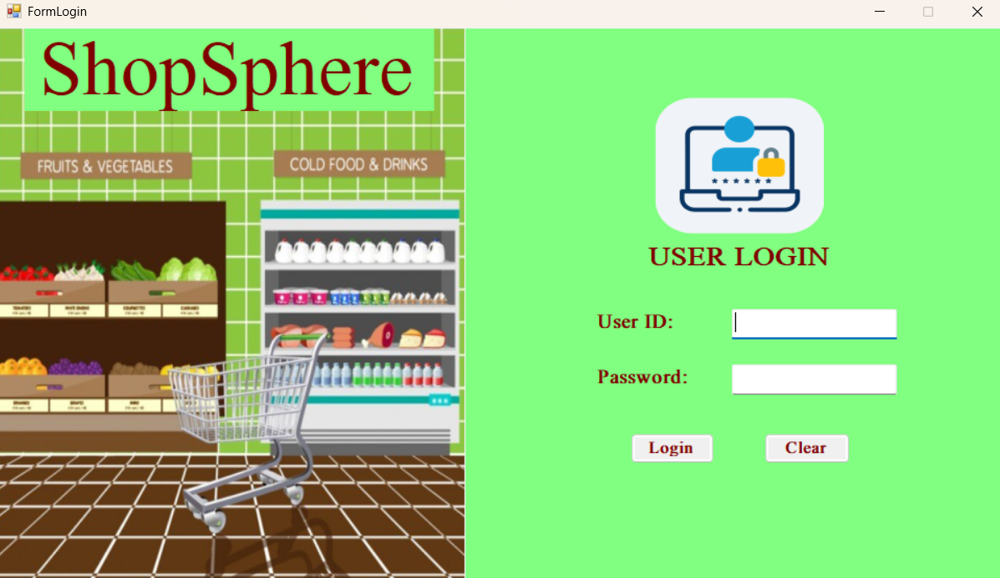
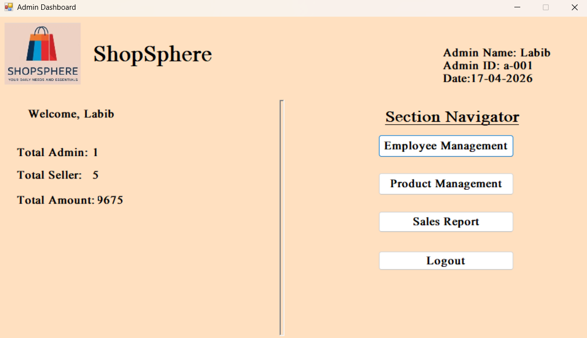
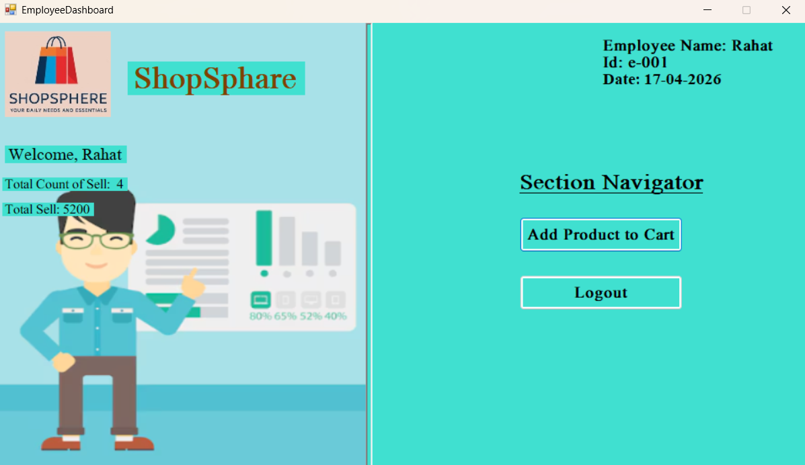
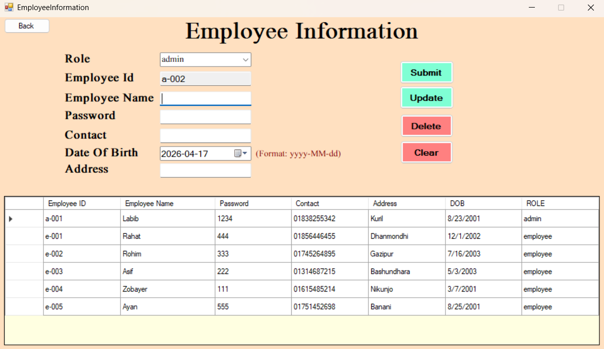
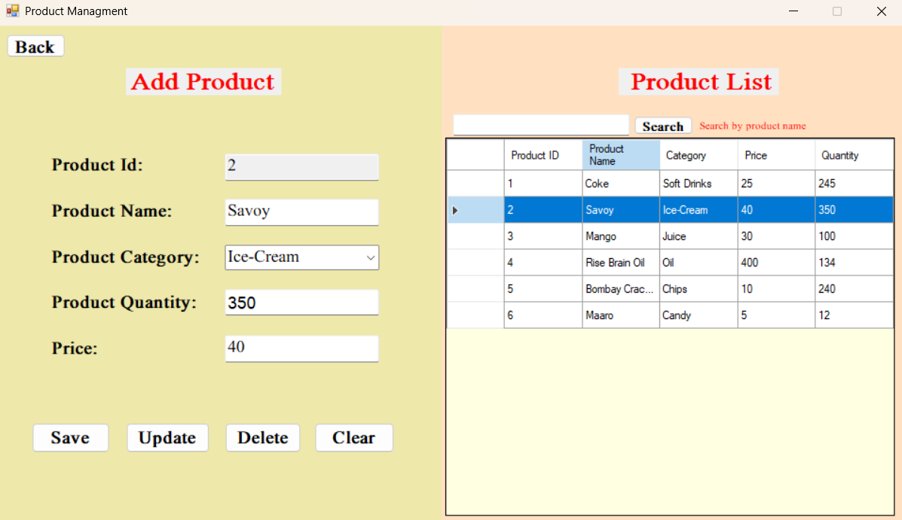
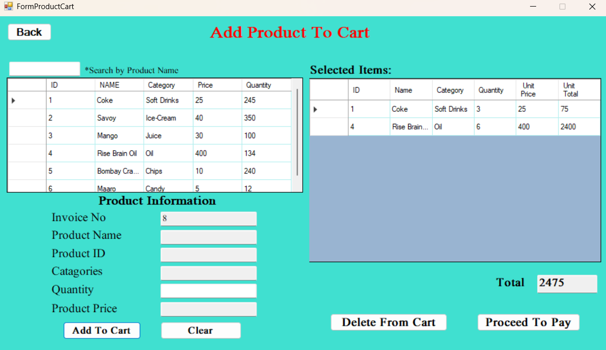
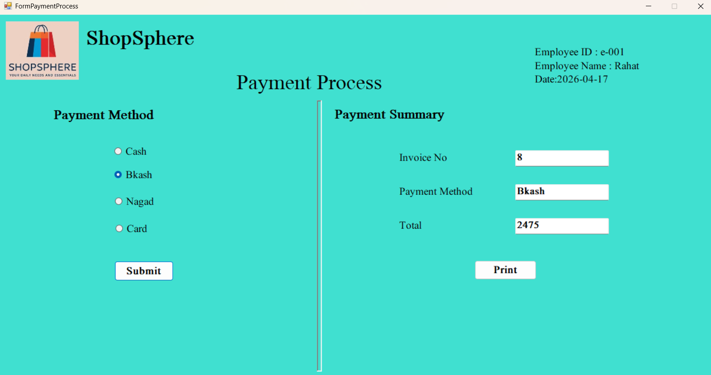
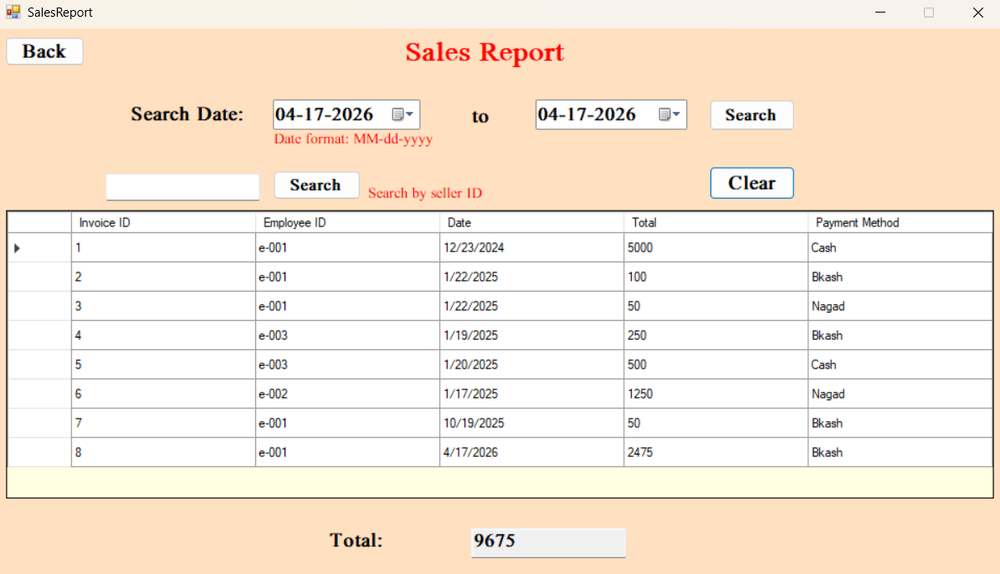

# 🛒 SuperShop Management System

A **Windows Forms desktop application** built with **C# and SQL Server** for managing a supershop's day-to-day operations. The system supports two types of users — **Admin** and **Employee** — each with their own dedicated dashboard and features.

---

## 🎬 Demo Video

[](https://www.youtube.com/watch?v=lqXE6UgKrlU&t=152s)

> 📺 **Watch on YouTube:** [https://www.youtube.com/watch?v=lqXE6UgKrlU&t=152s](https://www.youtube.com/watch?v=lqXE6UgKrlU&t=152s)

---

## 🛠️ Technologies Used

- **Language:** C# (.NET Framework)
- **UI Framework:** Windows Forms (WinForms)
- **Database:** Microsoft SQL Server
- **IDE:** Visual Studio
- **Database Connectivity:** ADO.NET (`SqlConnection`, `SqlCommand`, `SqlDataAdapter`)

---

## 🚀 How to Run

### Prerequisites
- Visual Studio (2019 or later)
- Microsoft SQL Server
- .NET Framework

### Steps

1. Clone the repository:
   ```bash
   git clone https://github.com/hedayet-ullah-patwary/SuperShop-Management-System-CSharp.git
   ```

2. Set up the database:
   - Open **SQL Server Management Studio (SSMS)**
   - Run the `Inventory.sql` file to create and populate the database

3. Update the connection string in `DataAccess.cs`:
   ```csharp
   new SqlConnection(@"Data Source=YOUR_SERVER_NAME;Initial Catalog=Inventory;Persist Security Info=True;User ID=YOUR_USER_ID;Password=YOUR_PASSWORD");
   ```

4. Open `ShopManagment.sln` in Visual Studio

5. Build & Run (`F5`)

---

## 📋 Features

### 🔐 1. Login System (`FormLogin`)



- Secure login for both **Admin** and **Employee** using Employee ID and Password
- Role-based authentication — the system automatically identifies the user's role from the database and redirects them to the appropriate dashboard
- Input validation to prevent empty submissions
- Error handling for wrong credentials

---

### 🧑‍💼 2. Admin Dashboard (`FormAdminDashboard`)



The central control panel for the Admin. Displays a real-time overview of:

- **Total number of Admins** in the system
- **Total number of Employees (Sellers)** in the system
- **Total sales amount** across all transactions

From here, the Admin can navigate to Employee Management, Product Management, and Sales Report.

---

### 🖥️ 3. Employee Dashboard (`FormEmployeeDashboard`)



The home panel for Employees after login. From here, employees can access the Product Cart for billing and view their assigned tasks.

---

### 👷 4. Employee Management (`FormEmployeeInformation`) — *Admin Only*



Full **CRUD (Create, Read, Update, Delete)** operations for managing shop staff.

**Features:**
- **Add** new employees with: Employee ID (auto-generated), Name, Password, Contact, Address, Date of Birth, and Role
- **Auto ID generation** — IDs are automatically created based on role (`a-001` for admin, `e-001` for employee)
- **Update** existing employee information
- **Delete** an employee with confirmation dialog; default accounts `a-001` and `e-001` are protected from deletion
- **Double-click** any row in the table to auto-fill the form fields for easy editing
- Input validation:
  - Name must contain only alphabetic characters
  - Contact must contain only numeric digits
  - All fields must be filled before saving

---

### 📦 5. Product Management (`FormProductManagment`) — *Admin Only*



Complete **CRUD** operations for managing inventory and products.

**Features:**
- **Add** new products with: Product ID (auto-generated), Name, Category, Price, and Quantity
- **Auto ID generation** based on the latest product in the database
- **Update** existing product details
- **Delete** a product with a confirmation prompt
- **Search** products by name (partial match supported)
- **Double-click** a product row to load its data into the form for quick editing
- Input validation:
  - Product name and category must contain only alphabetic characters
  - Quantity must be numeric
  - Price must be a non-negative number

---

### 🛒 6. Product Cart & Billing (`FormProductCart`) — *Employee Only*



The main selling interface for employees.

**Features:**
- View all available products with live inventory data
- **Real-time search** — type a product name to instantly filter the product list
- **Double-click** a product to load it into the selection fields
- **Add to Cart** — select a product and enter quantity to add it to the cart
  - Automatically checks stock availability before adding
  - If the same product is added again, quantities are merged (not duplicated)
- **Delete from Cart** — remove any item with a confirmation dialog; stock is restored automatically
- **Live total calculation** — cart total updates automatically after every add or remove
- **Auto Invoice ID generation** based on the latest invoice in the database
- Proceed to payment when the cart is ready

---

### 💳 7. Payment Processing (`FormPaymentProcess`) — *Employee Only*



Handles the final payment step after cart confirmation.

**Features:**
- Displays: Invoice Number, Employee ID, Employee Name, Date, and Total Bill amount
- Supports **4 payment methods:**
  - 💵 Cash
  - 📱 bKash
  - 📱 Nagad
  - 💳 Card
- After selecting a payment method and confirming, the invoice is saved to the database
- Automatically clears the cart after successful payment
- Prevents submission without a selected payment method

---

### 📊 8. Sales Report (`FormSalesReport`) — *Admin Only*



Allows the admin to view and analyze all sales records.

**Features:**
- Displays the **complete invoice history** from the database in a data table
- Shows the **total sales amount** at all times
- **Search by Employee ID** — filter invoices to see sales made by a specific employee
- **Search by Date Range** — filter invoices between a start and end date, with a filtered total shown
- **Clear** button to reset all filters and show all records

---

## 🗄️ Database Schema

The system uses a SQL Server database named `Inventory` with the following three tables:

**`emptable`** — Stores employee and admin accounts

| Column | Description |
|--------|-------------|
| EMP_ID | Employee ID (Primary Key) |
| NAME | Full name |
| PASSWORD | Login password |
| CONTACT | Phone number |
| ADDRESS | Home address |
| DOB | Date of birth |
| ROLE | `admin` or `employee` |

**`Product`** — Stores product and inventory data

| Column | Description |
|--------|-------------|
| Product_ID | Product ID (Primary Key) |
| Product_Name | Name of the product |
| Category | Product category |
| Price | Unit price |
| Quantity | Available stock |

**`Invoice`** — Stores all sales and transaction records

| Column | Description |
|--------|-------------|
| Invoice_Id | Invoice number (Primary Key) |
| EMP_ID | Employee who made the sale |
| Date | Transaction date |
| Total | Total bill amount |
| Payment_Method | Cash / bKash / Nagad / Card |

---

## 👤 Default Login Credentials

| Role | ID | Password |
|------|----|----------|
| Admin | `a-001` | *(set in DB)* |
| Employee | `e-001` | *(set in DB)* |

> You can find or update the default credentials by checking the `Inventory.sql` file.

---

## 📁 Project Structure

```
SuperShop-Management-System-CSharp/
├── Inventory.sql                        # SQL script to set up the database
├── Project Report.pdf                   # Full project report
├── screenshots/                         # UI screenshots
│   ├── LoginPage.png
│   ├── AdminDashboard.png
│   ├── EmpDashboard.png
│   ├── EpmInfo.png
│   ├── AddProduct.png
│   ├── ProductCard.png
│   ├── Payment.png
│   └── Report.png
└── ShopManagment/
    ├── ShopManagment.sln                # Visual Studio solution file
    └── ShopManagment/
        ├── DataAccess.cs                # Database connection & query execution
        ├── FormLogin.cs                 # Login screen
        ├── FormAdminDashboard.cs        # Admin home panel
        ├── FormEmployeeDashboard.cs     # Employee home panel
        ├── FormEmployeeInformation.cs   # Employee management (Admin)
        ├── FormProductManagment.cs      # Product/inventory management (Admin)
        ├── FormProductCart.cs           # Cart & billing (Employee)
        ├── FormPaymentProcess.cs        # Payment processing (Employee)
        ├── FormSalesReport.cs           # Sales report viewer (Admin)
        └── Program.cs                   # Application entry point
```

---

## 📄 License

This project was developed for academic purposes. Feel free to explore, learn from it, and build upon it!

---

> ⭐ If you found this project useful, please give it a **star** on GitHub!
